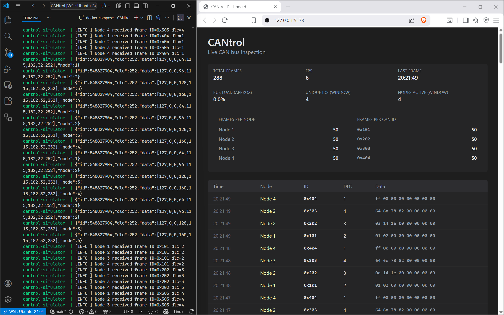

# CANtrol

A CAN Bus simulator written in C with a dashboard for realtime visualization of CAN frames. The project includes CMake build, Docker support 
for each module (simulation, bridge, dashboard), docker compose for building these and Github CI integration. 


## What is this?

CANtrol helps you learn and experiment with CAN (Controller Area Network) communication without needing physical hardware. 
It simulates multiple nodes exchanging messages on a CAN bus, and lets you see everything happening live in a web dashboard.


## Features

- CAN bus, nodes, drivers, and frames written in C. 
- Nodes can **send and receive frames**, each containing ID, DLC, and data bytes.
- Live **dashboard** built with React:
    - Dynamic **table** of the latest CAN frames.
    - **Stats panel** summarizing frames per node.
- Real-time updates via **WebSocket**, directly connected to the C simulator using TCP over the webserver bridge.
- Designed with **Docker** in mind for easy deployment.
- CI pipeline for automated build and validation


## Project Structure

```
CANtrol/
├── simulator/          # C CAN bus simulator source code
├── dashboard/          # React + Vite frontend
├── bridge/             # Node.js WebSocket bridge 
├── docker-compose.yml  # Connecting simulator + dashboard + bridge services
└── README.md
```


## Simulator -> Browser


## Development Notes

- Docker Compose networking is used for service discovery.
- Containers communicate using service names (e.g., `bridge`).
- TCP reconnect logic handles startup ordering.
- Output buffering is disabled in the simulator for real-time logs.


## Getting Started

### **Run with Docker Compose**

```bash
docker-compose up --build
```

Open your browser at http://localhost:5173 or the port assigned to your vite dev server (check the ports tab if you use VScode after docker-compose build), 
to view the dashboard with live CAN frames and statistics.

## Simulator + Dashboard



## Future Improvements

- Moving out frame generation from main to a specific module.
- Add filtering and sorting of frames by node or ID.
- Visualize frame traffic with charts.
- Extend CAN protocol support (e.g., RTR frames, extended IDs).
- Fault injection (delays, drops, corrupted frames)